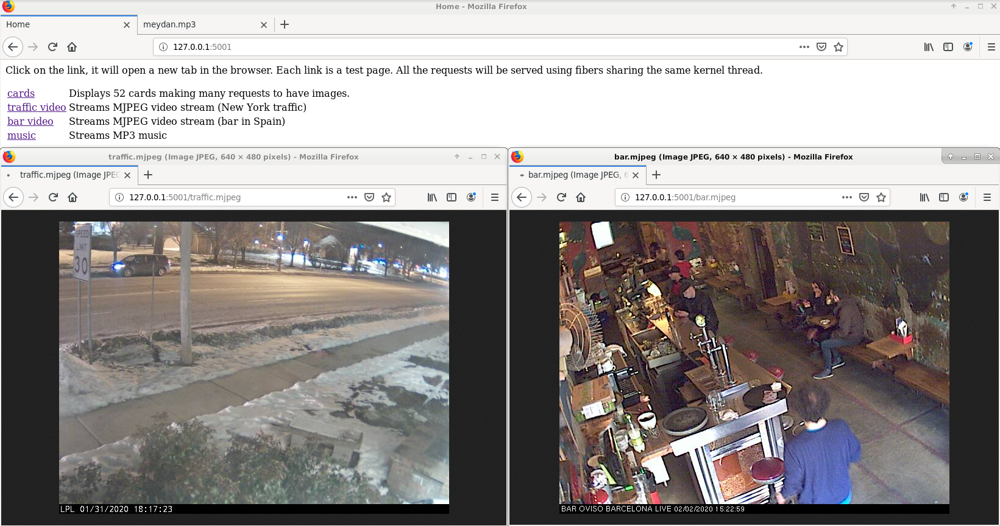

# libfiber

Userland cooperative threads aka fibers aka green threads aka coroutines.

## Introduction

This small library implements user land cooperative threads, they are called fibers. Fibers can be seen as a specialized case of coroutines which are a wider concept.

Each fiber has its own stack and shares the CPU with other fibers.
When it resumes execution, it restarts where it was just like a normal thread.
The difference with a 'normal' thread is that fibers to not run concurrently but sequentially in the same 'kernel' thread. Another difference is that fibers use a cooperative (vs preemptive) multitasking model.

It has advantages :
 * there is no need to lock data used by several fibers because they access this data sequentially
 * they are more lighter than 'kernel' thread and context switch is very fast

And it has drawbacks too :
 * each fiber must be 'fair' with other fibers and yield the CPU to give others a chance to run. If a single fiber fails to do so, the whole program will hang.
 * fibers will not take advantage of multi-processor machines, they will not spread naturally across the available CPU cores.

### Compilation

This library has been tested on linux debian on amd64, armhf and ppc64 architectures and on Cygwin. A slightly modified version has been used in production code.

### Unit tests

Unit tests depends on the check framework, which on debian is installed with :

~~~~
sudo apt-get install check
~~~~

To run them, type 'make check'. The unit tests are interesting to see how to use the lirary.

### Demos

A few demonstrations are provided :
 * perf : this is the most simple example. It will create 100 fibers which all do the same, they increment a global counter. The program stops when the counter reaches 50000000, which corresponds to 50000000 context switch between fibers. It then prints the time needed and the number of context switches.
 * basic : in this example, three fibers are created. They all do a small task, the scheduler run 3 times ans stops.
 * http: a small http server is started. A new fiber is started each time a new connection is done. The server is single threaded but the fibers share the CPU and handles several long lasting requests (like video delivery) at the same time.
 * sieve : this demonstration compute the 20 first prime numbers using integer generators implemented using fibers.
 
In each demo directory there is a makefile to compile the demo.

#### Screenshot of http demo

The URL for the demo is http://127.0.0.1:5001. On the screenshot there are two videos streamed by the server.

#### On the sieve demo

In this demonstration fibers are created on the fly and fibers call recursively other fibers and wait until an answer (an integer) is returned. Ths example shows how to implement blocking and non-blocking calls with arguments and results between fibers. It is implemented on the top of *channels* which are designed to post messages between fibers.

Here is the output of the program :

~~~~
localadmin@buster:~/libfiber/demo/sieve$ ./sieve 
prime#1 = 2
prime#2 = 3
prime#3 = 5
prime#4 = 7
prime#5 = 11
prime#6 = 13
prime#7 = 17
prime#8 = 19
prime#9 = 23
prime#10 = 29
prime#11 = 31
prime#12 = 37
prime#13 = 41
prime#14 = 43
prime#15 = 47
prime#16 = 53
prime#17 = 59
prime#18 = 61
prime#19 = 67
prime#20 = 71
~~~~

### Implementation

It was possible ans easier to use POSIX ucontext (with `makecontext()`, `setcontext()`, `getcontext()` and `swapcontext()`) but I choosed to use `setjmp()` / `longjmp()` C functions. The hard part is how to get a different stack for each fiber. There are several way to do this but I used `sigaltstack()` which allows to set an alternate stack for a signal handler. 

### Other fibers / coroutines implementations

There are many libraries implementing fibers and coroutines.

The C++ boost libraries have both and the implementation is fast and easy to use. I definitely recommend this.

Interstingly, in the http example, there is a base64 decoder with a coroutine like implementation. The trick used there is initially due to Simon Tatham.

### Usage and API documentation

The API documentation is included in the task.h source file.

There are two kinds of objects in the library schedulers (C type `scheduler_t`) and fibers (C type `fiber_t`). A fiber can't run by itself and must be started in a scheduler, which means that at least you must instantiate a scheduler (with `sched_new()`) and a fiber object (with `fiber_new()`). A fiber is added to a scheduler using `fiber_start()`.

The API allows to run a scheduler cycle using `sched_cycle()`. So if you need to run the fibers foreever you need to wrap the call to `sched_cycle()` in an infinite loop.

The schedule will run all fibers in turns and manage their states (i.e. transition between states). Fibers must cooperate and each running fibers must give back the CPU to give the others fibers a chance to run. A fiber give back the CPU using `fiber_yield()` or functions in the `fiber_wait_XXX()` family. With `fiber_yield()`, the fiber will restart at next scheduler cycle, which is not sure with `fiber_wait_XXX()` functions which suspend the execution until a condition is met.

Fibers terminates when their `run()` function returns. They can be forced to stop with a call to `fiber_stop()`. A fiber can stop itself with `fiber_stop()` but it just change its state, to give back the CPU a call to `fiber_yield()` must follow.

